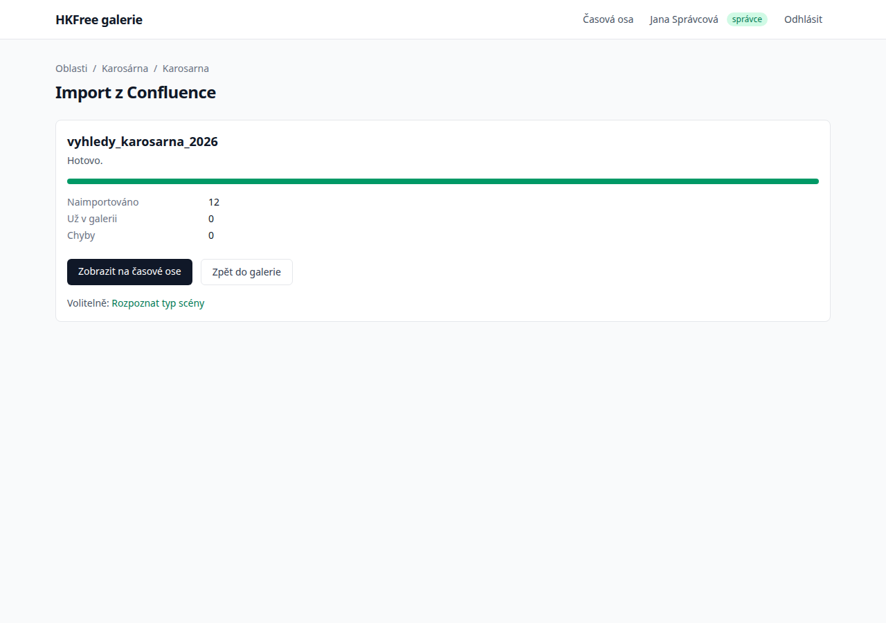

# Import z Confluence a popisy fotek

Správci galerie mohou vložit odkaz na stránku z fotoarchivu na
[doc.hkfree.org](https://doc.hkfree.org/spaces/fotogalerie) a fotky z ní se naimportují do
galerie AP. Každá fotka může mít krátký popis: z jakého AP a kterým směrem se díváme,
které další AP v tom směru leží a co je na fotce za scénu.

Dokumentace je uspořádaná podle metodiky [Diátaxis](https://diataxis.fr):

| | Když chcete… | Čtěte |
| --- | --- | --- |
| **Návod** | naimportovat první stránku a doplnit popisy | [První import](tutorial.md) |
| **Postupy** | splnit konkrétní úkol | [Postupy](how-to.md) |
| **Referenční příručka** | dohledat adresy, pravidla a nastavení | [Referenční příručka](reference.md) |
| **Vysvětlení** | pochopit, proč to funguje tak, jak to funguje | [Vysvětlení](explanation.md) |
