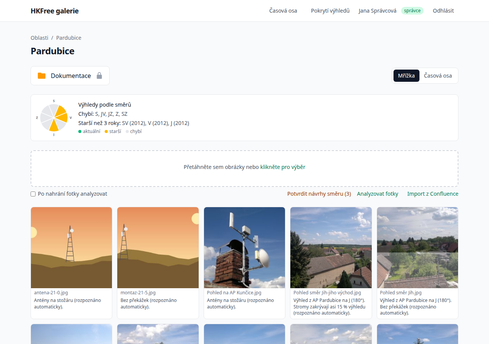
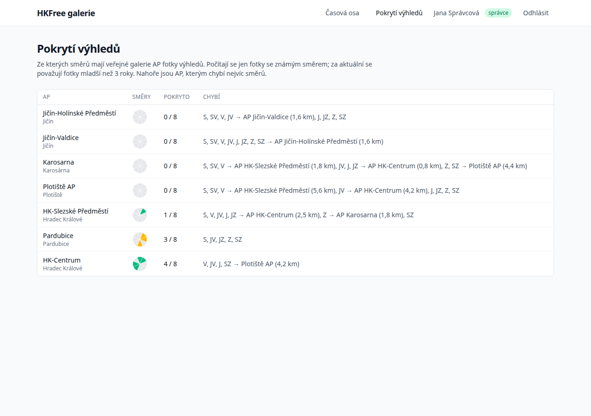

# Postupy

Návody na konkrétní úkoly. Předpokládají, že jste prošli [návod](tutorial.md).

**Pro správce galerií**

- [Naimportovat stránku z Confluence](#naimportovat-stránku-z-confluence)
- [Naimportovat fotky z rozcestníku](#naimportovat-fotky-z-rozcestníku)
- [Doplnit fotky, které na stránce přibyly](#doplnit-fotky-které-na-stránce-přibyly)
- [Zopakovat import, který skončil chybou](#zopakovat-import-který-skončil-chybou)
- [Nastavit nebo opravit směr pohledu](#nastavit-nebo-opravit-směr-pohledu)
- [Doplnit směr podle podobných fotek](#doplnit-směr-podle-podobných-fotek)
- [Zjistit, které výhledy chybí](#zjistit-které-výhledy-chybí)
- [Analyzovat starší fotky](#analyzovat-starší-fotky)
- [Analyzovat fotky hned po nahrání](#analyzovat-fotky-hned-po-nahrání)
- [Nahrávat fotky tak, aby se směr doplnil sám](#nahrávat-fotky-tak-aby-se-směr-doplnil-sám)

**Pro správce serveru**

- [Zprovoznit import na serveru](#zprovoznit-import-na-serveru)
- [Importovat z omezeného prostoru Confluence](#importovat-z-omezeného-prostoru-confluence)
- [Hostovat model pro rozpoznávání scén na vlastním serveru](#hostovat-model-pro-rozpoznávání-scén-na-vlastním-serveru)

---

## Naimportovat stránku z Confluence

1. Otevřete galerii AP (veřejnou, nebo **Dokumentace**, podle toho, kam fotky patří).
2. Klikněte na **Import z Confluence**.
3. Vložte adresu stránky a klikněte na **Načíst**.
4. Zkontrolujte náhled a klikněte na **Importovat**.

Přijímané tvary adres najdete v [referenční příručce](reference.md#podporované-adresy).

Importovat jde i blogový příspěvek z prostoru (adresa s `/blog/rok/měsíc/den/`). Pokud stránka
nemá makro **Galerie**, naimportují se i obrázky, které jsou jen v přílohách stránky a na
stránce samotné nejsou zobrazené; náhled je uvede jako „jen v přílohách stránky“.

## Naimportovat fotky z rozcestníku

Některé stránky fotky nemají a jen odkazují na podstránky (například **Karosarna**). Náhled
takové stránky napíše „Tato stránka neobsahuje žádné fotky k importu“ a vypíše podstránky.
Klikněte na podstránku a naimportujte ji obvyklým způsobem; postup opakujte pro každou.

## Doplnit fotky, které na stránce přibyly

Naimportujte stejnou stránku znovu. Fotky, které už v galerii jsou, se přeskočí (náhled je
ukáže jako **Už naimportováno**). Znovu se naimportuje jen to, co přibylo, a přílohy, které
někdo v Confluence nahradil novou verzí.

## Zopakovat import, který skončil chybou

Na stránce importu jsou u chybných fotek důvody (například „Stažení přílohy se nezdařilo“).
Spusťte import téže stránky znovu: úspěšně naimportované fotky se přeskočí a zkusí se jen
ty, které selhaly.

## Nastavit nebo opravit směr pohledu

1. V galerii AP najeďte na fotku a klikněte na ikonu kompasu vlevo nahoře.
2. Vyberte jeden z osmi směrů (**S**, **SV**, **V**, **JV**, **J**, **JZ**, **Z**, **SZ**).
3. Ručně nastavený směr má přednost před směrem z EXIF nebo z názvu souboru a při
   přeindexování se nepřepíše.

Směr smažete křížkem uprostřed kompasu.

## Doplnit směr podle podobných fotek

1. Nastavte směr několika fotkám AP — kompasem, nebo je pojmenujte se směrem v názvu.
2. Pokud ostatní fotky ještě nejsou analyzované, klikněte na **Analyzovat fotky**.
3. Obnovte stránku. Fotky, které se zřetelně podobají fotce se známým směrem, mají řádek
   **Návrh: …**.
4. Potvrďte je jednotlivě (**Potvrdit**), nebo všechny najednou (**Potvrdit návrhy směru**).

Návrhy se počítají ze všech fotek AP, veřejných i z Dokumentace, a přepočítají se pokaždé,
když přibude fotka se známým směrem. Čím víc směrů nastavíte, tím víc návrhů dostanete.

## Zjistit, které výhledy chybí

**U jednoho AP:** v galerii AP je nad fotkami růžice s osmi směry. Zelená výseč znamená
aktuální fotku (mladší než 3 roky), oranžová jen starší fotky a šedá chybějící směr. Pod
textem **Chybí** jsou chybějící směry a u nich AP, která v tom směru leží — výhled na ně je
pro síť nejcennější.



**U všech AP:** v záhlaví klikněte na **Pokrytí výhledů** (jen pro správce). Tabulka ukazuje
všechna AP od těch, kterým chybí nejvíc směrů, a u chybějících směrů nejbližší AP v tom
směru. Hodí se jako seznam úkolů pro příští výjezd s foťákem.



Počítají se jen fotky se známým směrem. Pokud AP fotky má, ale růžice je šedá, nastavte
fotkám směr (kompasem, nebo potvrzením návrhů).

## Analyzovat starší fotky

V galerii AP klikněte pod oblastí pro nahrávání na **Analyzovat fotky**. Analyzují se jen
fotky, u kterých ještě něco chybí (typ scény, zakrytí výhledu nebo otisk pro návrhy směru).
Nechte stránku otevřenou, dokud se neobjeví **Hotovo**; pak ji obnovte.

## Analyzovat fotky hned po nahrání

Zaškrtněte pod oblastí pro nahrávání **Po nahrání fotky analyzovat**. Po nahrání se nové fotky
nejdřív analyzují a teprve potom se stránka obnoví. Volba se pamatuje ve vašem prohlížeči.
Poprvé se stahují modely (asi 120 MB), proto je volba ve výchozím stavu vypnutá.

## Nahrávat fotky tak, aby se směr doplnil sám

Telefon ukládá do fotek polohu a směr kompasu, pokud má fotoaparát povolený přístup k poloze.
Takové fotky **nahrajte přímo do galerie** (přetažením), ne přes Confluence: fotky
v Confluence údaje EXIF nemají, takže by se směr ztratil.

Druhá možnost je uvést směr v názvu souboru, například `sever - směr Plačice.jpg`,
`vyhled_JV.jpg` nebo `128° jih.jpg`. Přehled rozpoznávaných zápisů je v
[referenční příručce](reference.md#směr-z-názvu-souboru).

## Zprovoznit import na serveru

Import běží jako úloha na pozadí, kterou spouští plánovač. Pokud už máte cron pro
`schedule:run` (kvůli časové ose), stačí nasadit novou verzi a spustit migrace:

```bash
php artisan migrate --force
```

Jinak přidejte cron podle README, krok 9 (**Scheduler (cron)**). Importy pak začínají do
minuty od kliknutí na **Importovat**.

## Importovat z omezeného prostoru Confluence

Prostor `fotogalerie` je čitelný bez přihlášení. Pro prostory s omezeným přístupem vytvořte
v Confluence osobní přístupový token (Personal Access Token) účtu, který do prostoru vidí, a
nastavte ho v `.env`:

```dotenv
CONFLUENCE_TOKEN=váš-token
```

Pak obnovte mezipaměť konfigurace: `php artisan config:cache`.

## Hostovat model pro rozpoznávání scén na vlastním serveru

Prohlížeč stahuje model `Xenova/clip-vit-base-patch32` ze serveru Hugging Face. Pokud ho chcete
nabízet z vlastního serveru:

1. Zrcadlete soubory modelu ve stejné struktuře, jakou používá Hugging Face
   (`Xenova/clip-vit-base-patch32/resolve/main/…`).
2. Nastavte v `.env` adresu zrcadla:

   ```dotenv
   GALLERY_SCENE_MODEL_URL=https://modely.example.org/
   ```

3. Obnovte mezipaměť konfigurace: `php artisan config:cache`.
