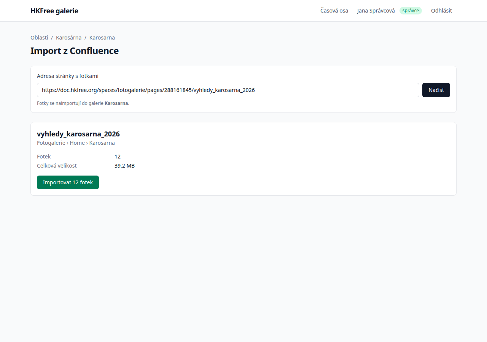
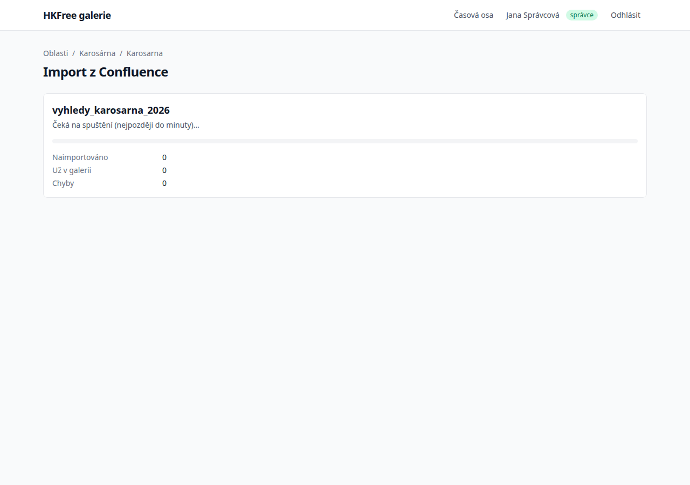
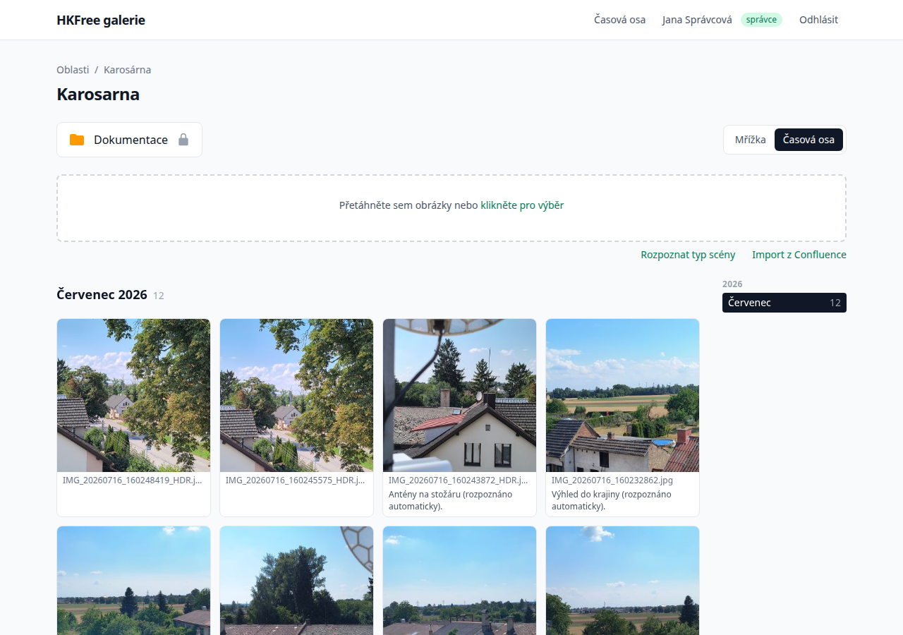
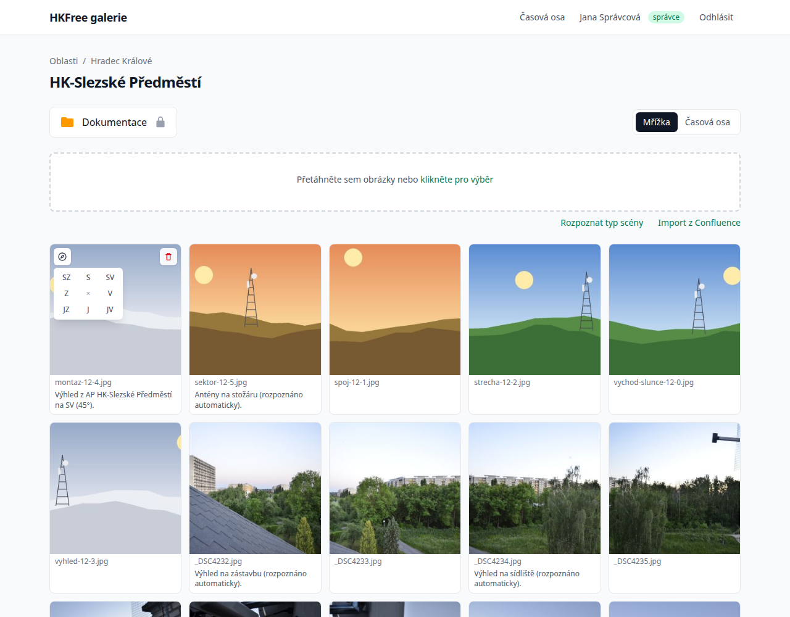
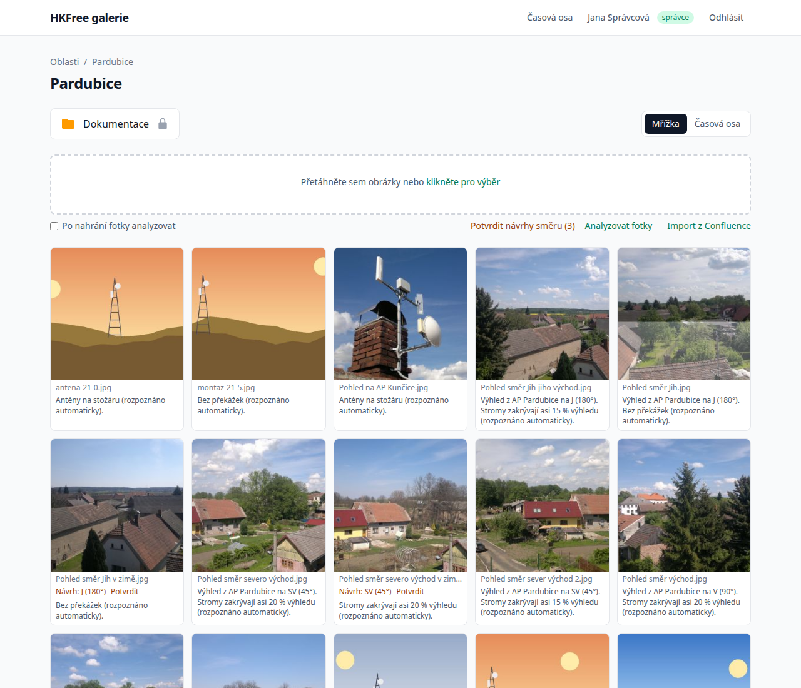

# Návod: první import z Confluence

V tomto návodu naimportujete fotky z jedné stránky fotoarchivu do galerie AP, necháte je
analyzovat, jedné fotce nastavíte směr pohledu a potvrdíte směr, který galerie navrhne. Potřebujete účet s rolí správce
galerie. Zabere to pár minut.

## 1. Najděte stránku s fotkami

V Confluence otevřete stránku s výhledy z AP, například
`vyhledy_karosarna_2026` pod stránkou **Karosarna**. Zkopírujte její adresu z adresního řádku.

## 2. Otevřete import v galerii AP

Přihlaste se tlačítkem **Přihlásit** a otevřete galerii AP, do které fotky patří.
Pod oblastí pro nahrávání klikněte na **Import z Confluence**.

## 3. Načtěte náhled

Vložte adresu do pole **Adresa stránky s fotkami** a klikněte na **Načíst**. Galerie stránku
přečte, ale zatím nic nestahuje:

Vidíte název stránky, kolik fotek obsahuje a jak jsou velké. Kdyby název stránky ani
nadřazených stránek neodpovídal tomuto AP, objeví se žluté upozornění — pak zkontrolujte,
že importujete do správné galerie.

## 4. Spusťte import

Klikněte na **Importovat 12 fotek**. Otevře se stránka s průběhem importu. Import běží na
pozadí a začne nejpozději do minuty; stránka se sama obnovuje:

Až import doběhne, uvidíte počet naimportovaných fotek a případné chyby:

## 5. Nechte fotky analyzovat

Na stránce hotového importu klikněte na **Analyzovat fotky**. Modely běží přímo ve vašem
prohlížeči; poprvé se stáhne asi 120 MB, potom trvá jedna fotka zlomek sekundy. Analýza
rozpozná typ scény, změří, jak moc výhled zakrývají stromy, a spočítá „otisk“ fotky pro
hledání podobných fotek. Počkejte, až se objeví **Hotovo**.

## 6. Prohlédněte si fotky na časové ose

Klikněte na **Zobrazit na časové ose**. Fotky jsou zařazené do měsíce, kdy byly pořízené
(nebo nahrané do Confluence), a pod fotkami je typ scény a zakrytí výhledu:

## 7. Nastavte směr pohledu

Přejděte do zobrazení **Mřížka**. Najeďte myší na fotku a klikněte na ikonu kompasu v levém
horním rohu. Vyberte směr, kterým se na fotce díváte, například **SV**:

Popis pod fotkou se hned změní. Pokud v tom směru leží jiné AP, popis ho jmenuje i se
vzdáleností, například „Výhled z AP HK-Centrum na SV (45°) — směrem AP HK-Slezské Předměstí
(2,5 km)“.

## 8. Potvrďte navržený směr

Když mají některé fotky AP směr nastavený, galerie navrhne směr i ostatním fotkám téhož
výhledu — třeba stejnému pohledu vyfocenému v zimě nebo o pár let později. Pod takovou fotkou
je oranžový řádek **Návrh: SV (45°) Potvrdit**:

Klikněte na **Potvrdit**, nebo potvrďte všechny návrhy najednou tlačítkem
**Potvrdit návrhy směru** nad fotkami. Návrh, který nesedí, prostě nepotvrzujte a nastavte
směr kompasem.

## Co jste se naučili

Naimportovali jste stránku z Confluence, nechali fotky analyzovat, ručně nastavili směr
pohledu a potvrdili navržený směr. Další úkoly najdete v [postupech](how-to.md); proč popisy vypadají tak, jak
vypadají, vysvětluje [vysvětlení](explanation.md).
