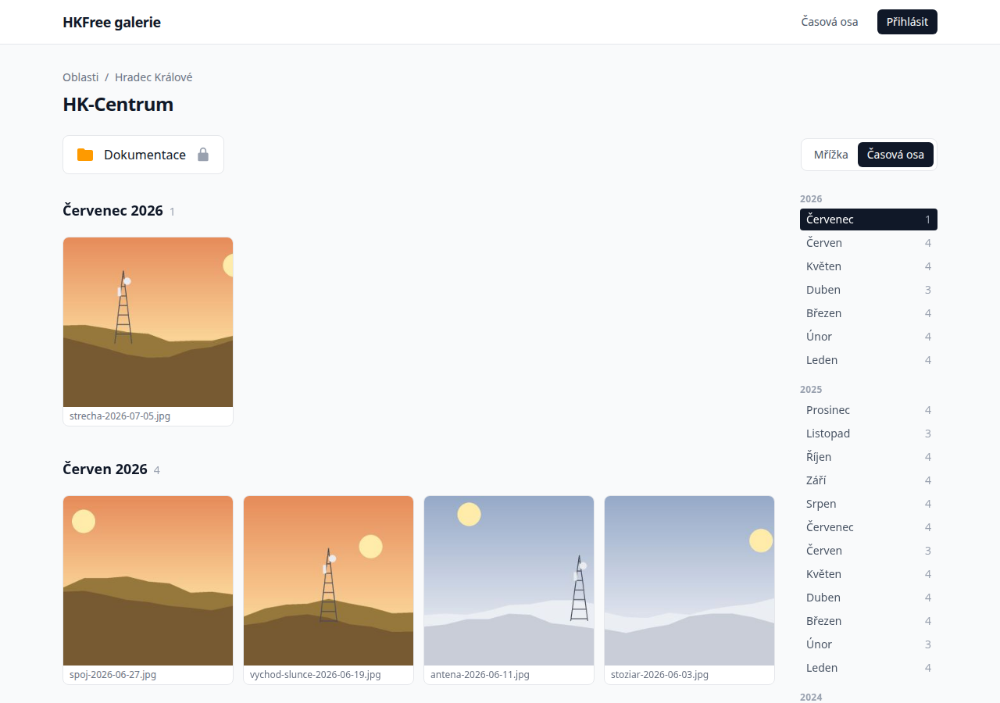

# Dokumentace časové osy

Časová osa zobrazuje fotky z galerie seskupené po měsících, od nejnovějších, a umožňuje
listovat zpět do minulosti. Existuje ve dvou podobách: uvnitř galerie každého AP a pro celou
síť najednou.

Dokumentace je uspořádaná podle metodiky [Diátaxis](https://diataxis.fr). Vyberte si část
podle toho, co právě potřebujete:

| | Když chcete… | Čtěte |
| --- | --- | --- |
| **Návod** | naučit se časovou osu krok za krokem | [Seznámení s časovou osou](tutorial.md) |
| **Postupy** | splnit konkrétní úkol | [Postupy](how-to.md) |
| **Referenční příručka** | dohledat adresy, parametry, pravidla a příkazy | [Referenční příručka](reference.md) |
| **Vysvětlení** | pochopit, proč to funguje tak, jak to funguje | [Vysvětlení](explanation.md) |
