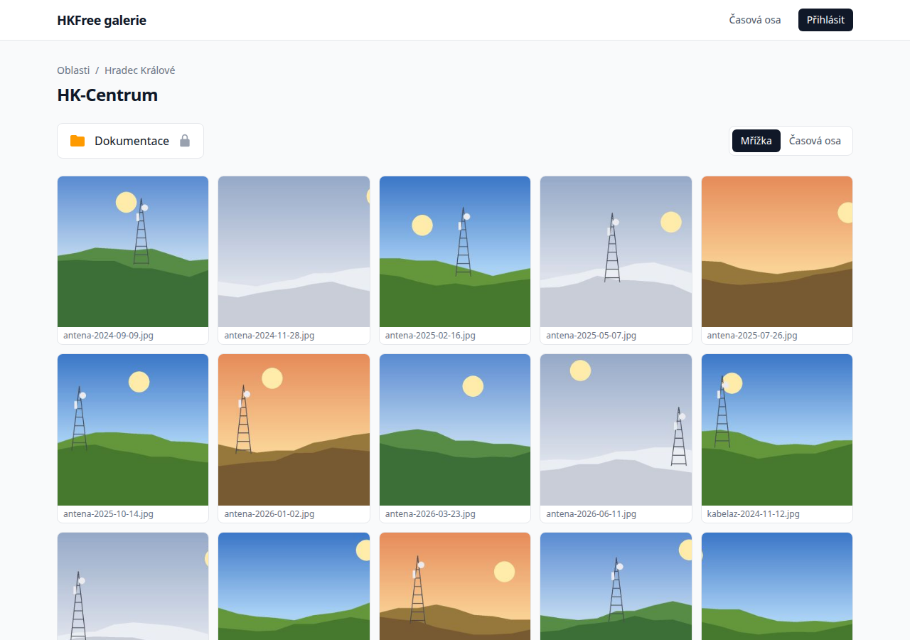
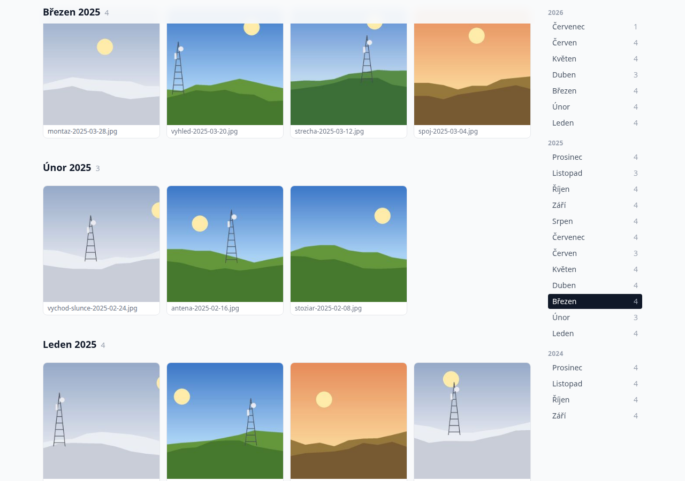
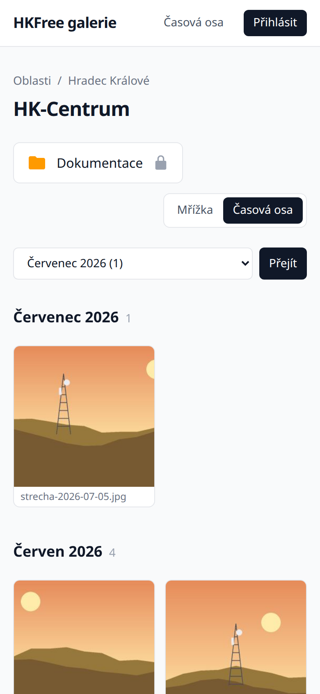
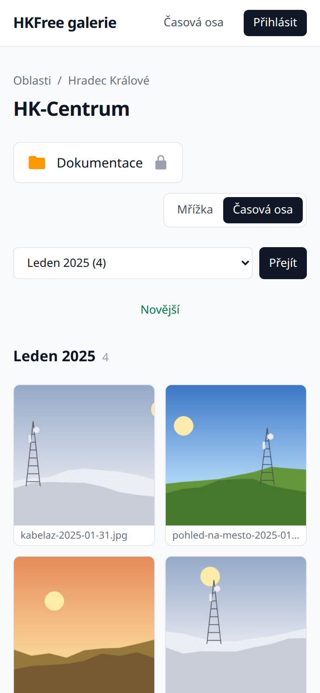
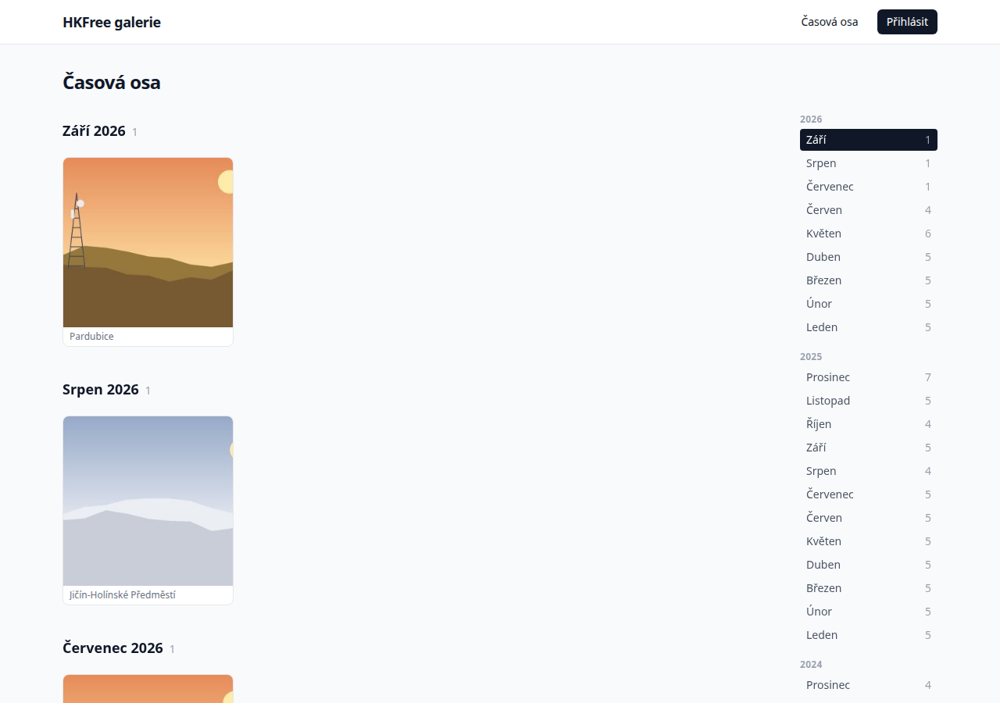
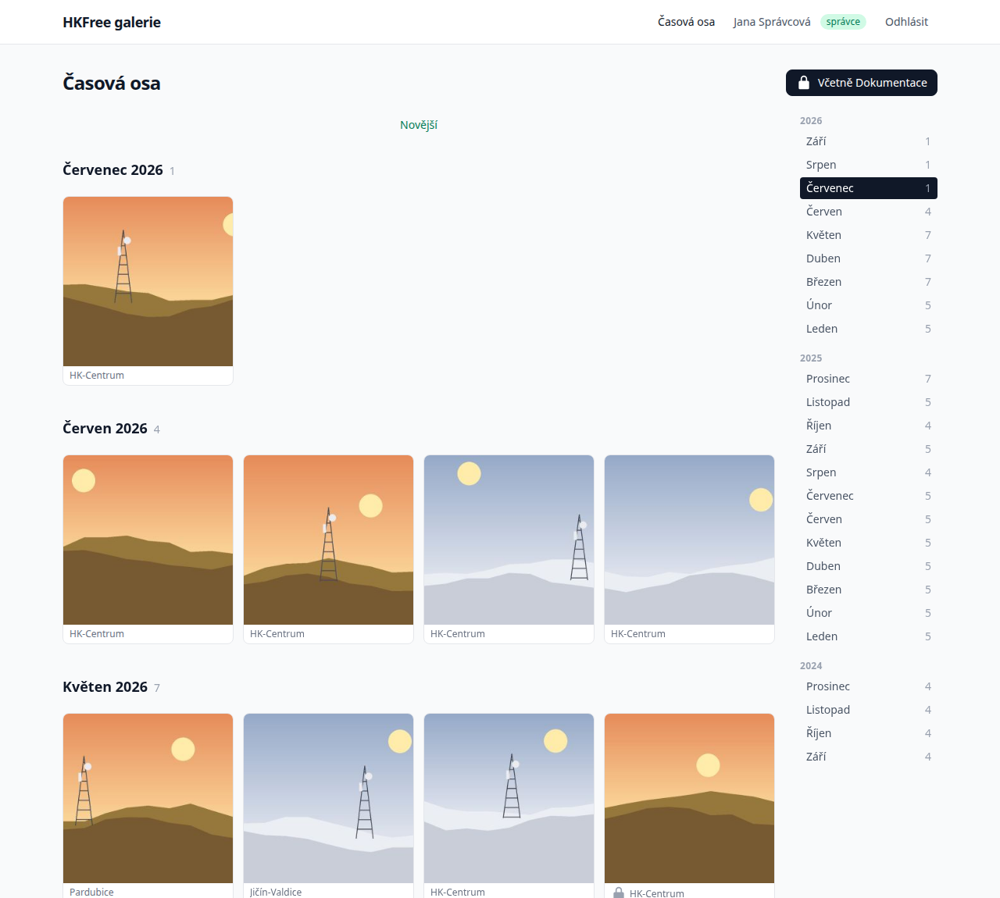

# Tutorial: exploring the timeline

In this tutorial you will browse one AP's photos month by month, jump back to an older month,
and then look at the whole network's photos in one stream. It takes about five minutes and
needs nothing but a browser. Signing in is only needed for the last step.

## 1. Open an AP gallery

On the home page (**Oblasti**), click any AP, for example **HK-Centrum**. You land in the
familiar grid of photos, sorted by file name.

At the top right is a switch with two options: **Mřížka** (Grid) and **Časová osa** (Timeline).

## 2. Switch to the timeline

Click **Časová osa**. The same photos are now grouped into months, newest month first:

Notice:

- Each month has a heading, such as **Červenec 2026**, followed by the number of photos in that
  month.
- The column on the right lists every month that has photos, grouped by year, with counts.
  The month you are looking at is highlighted.

## 3. Scroll back in time

Scroll down. Older months appear on their own as you approach the end of the page. Keep going
for a while, then look at the address bar: it now ends with something like `?from=2025-03`,
the month at the top of your screen.

The heading of the current month stays pinned at the top while you scroll through it, and the
month index follows along.

Reload the page. You come back to the same month instead of starting over from the newest
photos.

## 4. Jump straight to a month

In the month index on the right, click a month in an earlier year, for example **Leden** under
**2025**. The page now starts at January 2025, and a **Novější** (Newer) link at the top takes
you back to the newest photos.

On a phone the month index becomes a drop-down above the photos. Choosing a month there jumps
to it the same way:

| Timeline on a phone | After choosing January 2025 |
| --- | --- |
|  |  |

## 5. See the whole network

Click **Časová osa** in the page header. This timeline shows the photos of every AP in one
stream. Under each photo is the name of its AP; click it to open that AP's timeline.

## 6. Include documentation photos (signed in)

Sign in with **Přihlásit**. A **Zobrazit i Dokumentaci** button appears next to the heading.
Click it, and photos from the private documentation galleries join the stream, marked with a
lock icon. Click **Včetně Dokumentace** to hide them again.

## What you have learned

You switched an AP gallery between grid and timeline, scrolled back through its months,
jumped to a specific month on desktop and phone, and browsed the network-wide timeline with and
without documentation photos.

Next, see the [how-to guides](how-to.md) for specific tasks, or the
[explanation](explanation.md) to learn how photos get their dates.
